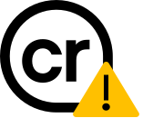

# C2PA Extension Validator

*NOTE*: this project is a developer preview prototype; it is not meant to be used in production.

This project contains a Edge/Chrome/Firefox browser extension that can validate [C2PA](https://c2pa.org) assets. Our goal is to provide a developer tool to

1. encourage experimentation with C2PA technologies, and
2. enable rapid prototyping of new C2PA features.

The extension must be built and side-loaded into a browser; see the [setup](#setup) section. The extension doesn't contain a built-it certificate trust list, these must be imported by the user; see the [trust setup](#trust-setup) section.  

The extension makes use of [c2pa](https://github.com/contentauth/c2pa-js) library from the [Content Authenticity Initiative](https://github.com/contentauth).

The following asset types can be verified by the extension:

* Images: JPEG, PNG, WEBP
* Videos: mp4

## Setup

As a prerequisite, install the [pnpm](https://pnpm.io/installation) package manager.

### Install dependencies

```bash
pnpm install
```

### Build the extension

```bash
pnpm run build
```

### Install the extension in a browser

Follow the side-loading instruction for your browser to load the extension:

* [Edge](https://learn.microsoft.com/en-us/microsoft-edge/extensions-chromium/getting-started/extension-sideloading)  
* [Chrome](https://developer.chrome.com/docs/extensions/mv3/getstarted/development-basics/#load-unpacked)  
* [Firefox](https://extensionworkshop.com/documentation/develop/temporary-installation-in-firefox/)

The Edge/Chrome `manifest.json` file is located at `dist/chrome`. The Firefox `manifest.json` file is located at `dist/firefox`.

Firefox requires additional extension permissions to download manifests from external sites:

  1. In the Firefox address bar go to `about:addons` to see the installed extensions
  2. Find **Cross-Platform Origin of Content Extension** and click the `...` button to the right
  3. Select **Manage** from the pop-up menu
  4. Click the **Permission** tab
  5. Enable **Access your data for all websites**

### Test the extension

Visit these pages to test the extension:

* [Public test page](./test/public-tests.html), containing valid assets from various test issuers
* [Unit test page](./test/unit-tests.html), containing valid, untrusted, and invalid assets of different media types

## Usage

### Trust Setup

Users must import a list of trusted signers for C2PA assets to be validated properly; the trust lists must be formatted as [described here](https://github.com/christianpaquin/c2pa-explorations/blob/main/trust-lists/trust-lists.md). This can be done through the `Options` tab of the browser extension's toolbar popup window.

### Asset Validation

*Note*: the underlying C2PA library that does the certificate validation does not currently accept trust anchors to create complete X.509 chains; the full certificate chain must therefore be present in a C2PA manifest to be considered valid.

The extension automatically scans the current HTML page for C2PA assets and validates them. An icon representing the validation status is then overlayed on the asset:

|                                                                  |                                                                                     |
|------------------------------------------------------------------|-------------------------------------------------------------------------------------|
|     |a valid asset, i.e. a well-formed C2PA manifest signed by a trusted issuer           |
|  | an untrusted asset, i.e., a well-formed C2PA manifest signed by an untrusted issuer |
|  | a invalid asset                                                                     |

See the [C2PA specification](https://c2pa.org/specifications/specifications/2.0/specs/C2PA_Specification.html#_statements_by_a_validator) for the definition of well-formed manifests and trusted signers.

Note that untrusted _warning_ icon is not currently specified in the [C2PA UX recommendations](https://c2pa.org/specifications/specifications/1.4/ux/UX_Recommendations.html).

## Contributing

This project welcomes contributions and suggestions.  Most contributions require you to agree to a
Contributor License Agreement (CLA) declaring that you have the right to, and actually do, grant us
the rights to use your contribution. For details, visit <https://cla.opensource.microsoft.com>.

When you submit a pull request, a CLA bot will automatically determine whether you need to provide
a CLA and decorate the PR appropriately (e.g., status check, comment). Simply follow the instructions
provided by the bot. You will only need to do this once across all repos using our CLA.

This project has adopted the [Microsoft Open Source Code of Conduct](https://opensource.microsoft.com/codeofconduct/).
For more information see the [Code of Conduct FAQ](https://opensource.microsoft.com/codeofconduct/faq/) or
contact [opencode@microsoft.com](mailto:opencode@microsoft.com) with any additional questions or comments.

## Trademarks

This project may contain trademarks or logos for projects, products, or services. Authorized use of Microsoft
trademarks or logos is subject to and must follow
[Microsoft's Trademark & Brand Guidelines](https://www.microsoft.com/en-us/legal/intellectualproperty/trademarks/usage/general).
Use of Microsoft trademarks or logos in modified versions of this project must not cause confusion or imply Microsoft sponsorship.
Any use of third-party trademarks or logos are subject to those third-party's policies.
